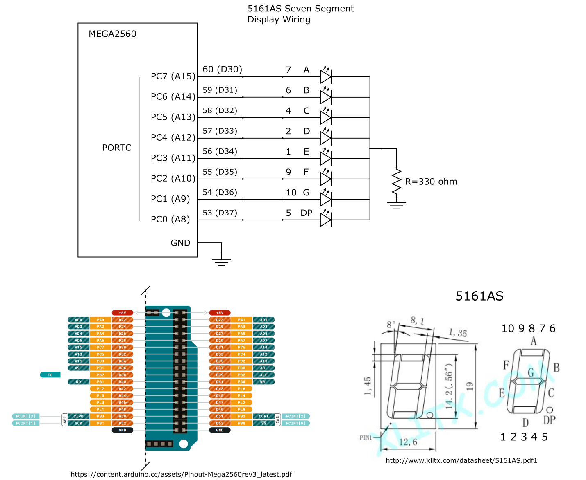

# seven_segment

This program demonstrates the use of a 5161AS 7 segment display with the Arduino Mega2560
LEDs are wired with common cathode (-), see 5161AS_wiring.png for wiring diagram
Tristan Hill - 2023/01/26 

 